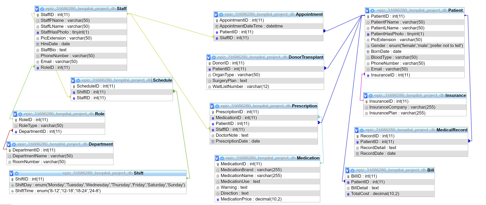

# HospitalProject-Group3

<div id="top"></div>
<!-- PROJECT LOGO -->
<br />
<div align="center">
  <a href="https://github.com/Xuanwen1101/HospitalProject-Group3">
    
  </a>

  <h3 align="center">Hospital Project</h3>
</div>


<!-- TABLE OF CONTENTS -->
<details>
  <summary>Table of Contents</summary>
  <ol>
    <li>
      <a href="#about-the-project">About The Project</a>
      <ul>
        <li><a href="#team-members">Team Members</a></li>
      </ul>
      <ul>
        <li><a href="#built-with">Built With</a></li>
      </ul>
    </li>
    <li>
      <a href="#getting-started">Getting Started</a>
    </li>
    <li><a href="#example-api-commands">Example API Commands</a></li>
    <li><a href="#entities-relationship">Entities Relationship</a></li>
    <li><a href="#project-scope">Project Scope</a></li>
    <li><a href="#future-features">Future Features</a></li>
    <li><a href="#license">License</a></li>

  </ol>
</details>


<!-- ABOUT THE PROJECT -->
## About The Project


<p align="right">(<a href="#top">back to top</a>)</p>


### Team Members

* [Deisy Koewati](https://github.com/Deisy25)
* [Hilda Obioma](https://github.com/hildaobi)
* [Rohit Sharma](https://github.com)
* [Sean Trudel](https://github.com/AvidMaker12)
* [Xuanwen Zheng](https://github.com/Xuanwen1101)

<p align="right">(<a href="#top">back to top</a>)</p>


### Built With

* [.NET](https://docs.microsoft.com/en-us/dotnet/)
* [C#](https://docs.microsoft.com/en-us/dotnet/csharp/)
* [Bootstrap](https://getbootstrap.com)
* [JQuery](https://jquery.com)

<p align="right">(<a href="#top">back to top</a>)</p>


<!-- GETTING STARTED -->
## Getting Started

- Clone the repository in Visual Studio
- Locate the project folder on the computer
- Create an <App_Data> folder in the project folder
- Open Package Manage Console in VS (Tools > Nuget Package Manager > Package Manage Console) and build the database
```
update-database
```
- Check that the database (View > SQL Server Object Explorer > MSSQLLocalDb > ...)
- Run the example API commands through CURL
- The project has been set up


<p align="right">(<a href="#top">back to top</a>)</p>


<!-- API EXAMPLES -->
## Example API Commands

Update 44342 to match the current port number.
Make sure to utilize Jsondata/staff.json to formulate data you wish to send as part of the POST requests. 
{id} should be replaced with the staff's primary key ID. 

Get a List of Staffs
```
curl https://localhost:44342/api/StaffData/ListStaffs
```

Find the selecsted Staff
```
curl https://localhost:44342/api/StaffData/FindStaff/{id}
```

Add a new Staff (new movie info is in staff.json)
```
curl -H "Content-Type:application/json" -d @staff.json https://localhost:44342/api/StaffData/AddStaff
```

Delete the selecsted Staff
```
curl -d "" https://localhost:44342/api/StaffData/DeleteStaff/{id}
```

Update a Staff (add the selected staff id into staff.json)
```
curl -H "Content-Type:application/json" -d @staff.json  https://localhost:44342/api/StaffData/UpdateStaff/{id}
```

Update an Staff's Picture (the staff picture is in file.jpg) 
```
curl -F StaffPicture=@file.jpg https://localhost:44342/api/StaffData/UploadStaffPicture/{id}
```


<p align="right">(<a href="#top">back to top</a>)</p>


<!-- Entities Relationship -->
## Entities Relationship




<p align="right">(<a href="#top">back to top</a>)</p>


<!-- Project Scope -->
## Project Scope
- Manage Appointment (CRUD) - Hilda
- Manage Bill (CRUD) - Hilda
- Manage Department (CRUD) - Sean
- Manage Donor Transplant (CRUD) - Rohit
- Manage Insurance (CRUD) - Deisy
- Manage Medical Record (CRUD) - Rohit
- Manage Medication (CRUD) - Deisy
- Manage Patient (CRUD) - Hilda
- Manage Prescription (CRUD) - Sean
- Manage Role (CRUD) - Xuanwen
- Manage Shift (CRUD) - Xuanwen
- Manage Staff (CRUD) - Xuanwen
- Manage Relationship between Shift and Staff - Xuanwen
- User Authentication - Deisy


<p align="right">(<a href="#top">back to top</a>)</p>


<!-- Future Features & Improvements -->
## Future Features


<p align="right">(<a href="#top">back to top</a>)</p>


<!-- LICENSE -->
## License

Distributed under the MIT License.

<p align="right">(<a href="#top">back to top</a>)</p>


